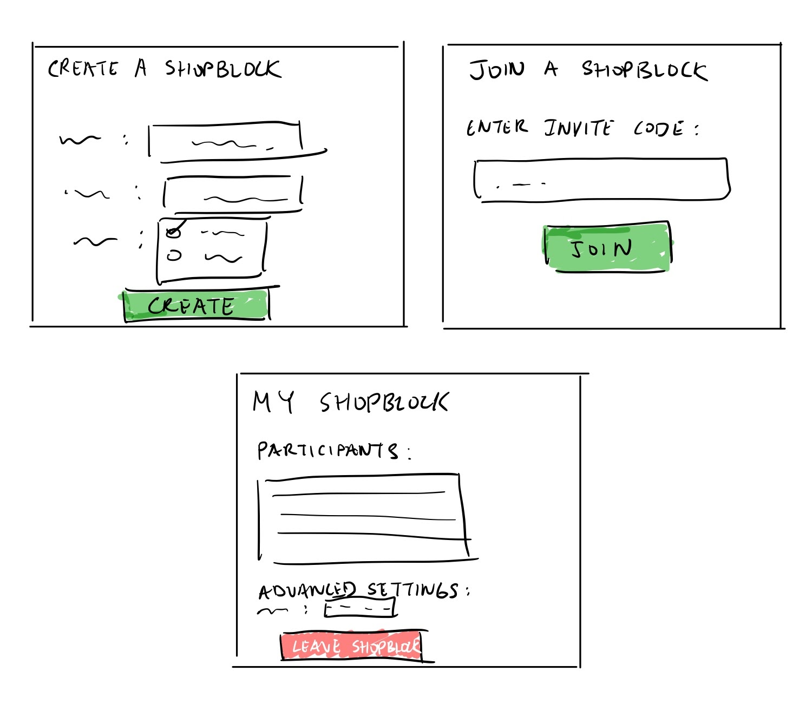
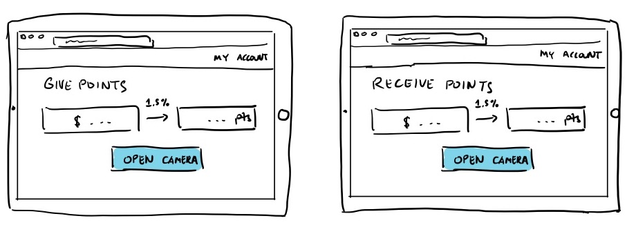
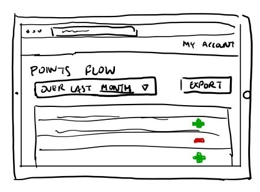
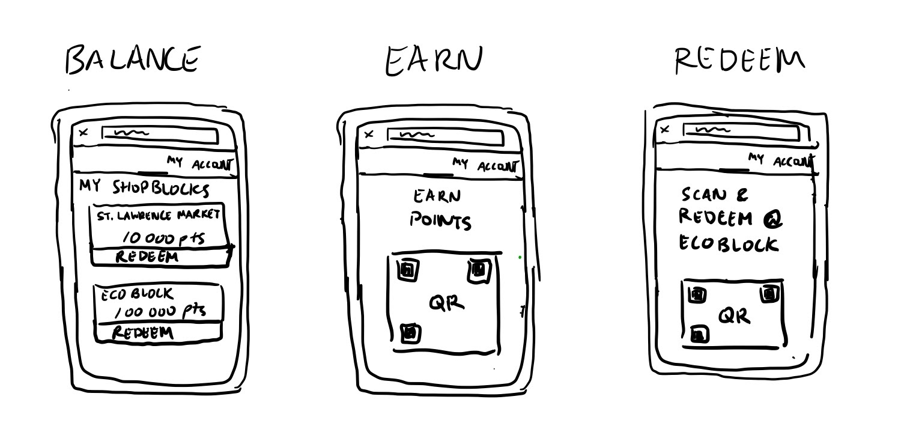
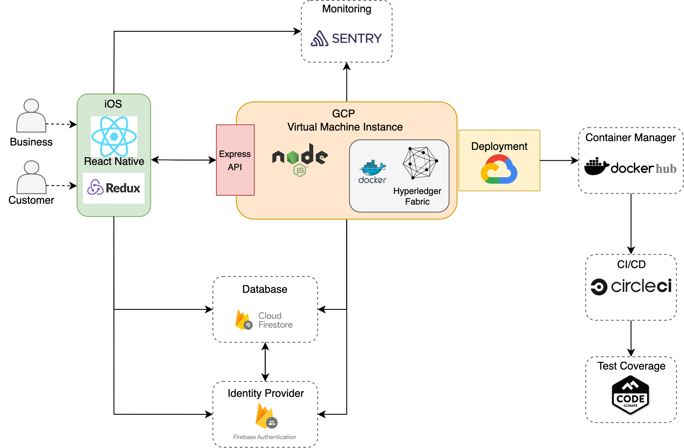

# ShopBlock

  

## Table of Contents
---
- [What is ShopBlock?](#what-is-shopblock)
- [Demo](#demo-video)
- [MVP Use Cases](#use-cases)
- [Architecture](#architecture-diagram)
- [The Team](#the-team)
  - [People](./team/README.md)
  - [Diversity](./team/diversity.md)
  - [Team Principles](./team/team_principles.md)

## What is ShopBlock?
ShopBlock is a company founded in the blockchain industry. ShopBlock aims to revolutionize loyalty programs using blockchain by facilitating inter-businesses collaboration and rewards tracking.

## Demo Video

https://user-images.githubusercontent.com/33843066/166065943-a70f61fc-2c03-4feb-8efb-ce633a9a6590.mp4

## Use cases
A ShopBlock is a network of partnered businesses for shared loyalty points exchange. Every ShopBlock on our platform uses the same conversion rate from points to CAD. ShopBlock's MVP will support the following use cases:

1. As a business, I can create, join by invitation, or leave a ShopBlock.

  

_Figure 1: Sketch for Use case 1. Clockwise, starting top left: Creating a new ShopBlock. Joining a ShopBlock using an invite code. Viewing ShopBlock details with the option to leave it._

2. As a business, I can give points to a customer based on the amount of CAD they spent. I can accept points from customers as a form of payment.


  

_Figure 2: Sketch for Use case 2. Left to right: Allocating a number of points to give to a customer based on the CAD amount paid and the CAD-point conversion rate. Computing the number of points to collect from the customer as a replacement for paying in CAD._

3. As a business, I can view the total number of points I gave to customers and received from customers, respectively, over a given time period for accounting purposes.

  

_Figure 3: Sketch for Use case 3. A business can select a time window (center left), and view and export all incoming and outgoing point transactions (bottom and center right, respectively)._

4. As a customer, I can view my balance, earn and redeem my points within the ShopBlock of issue.

  



_Figure 4: Sketch for Use case 4. The two rightmost sketches show a QR code. Tentatively, this QR code will identify a customer when earning and redeeming points and will be scanned by the business’ mobile device to complete the transaction._

## Architecture Diagram

  

## The Team

### Business Team

    
    
    

- [Ritesh Kumar](./team/ritesh_kumar.md)
- [Micaela Consens](./team/micaela_consens.md)
- [Elias Williams](./team/elias_williams.md)

### Dev Team

    
    
    

- [Alex Yu (Team Lead)](./team/alex_yu.md)
- [Filip Balucha](./team/filip_balucha.md)
- [Kirby Chin](./team/kirby_chin.md)
